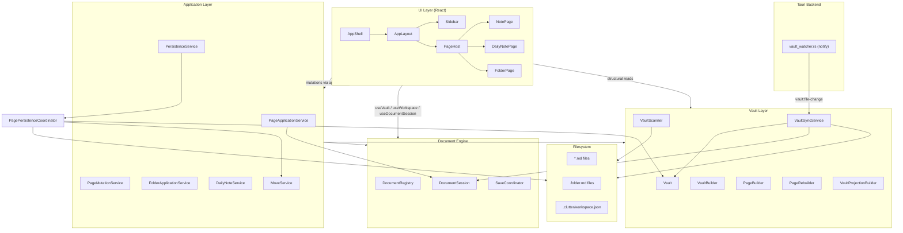
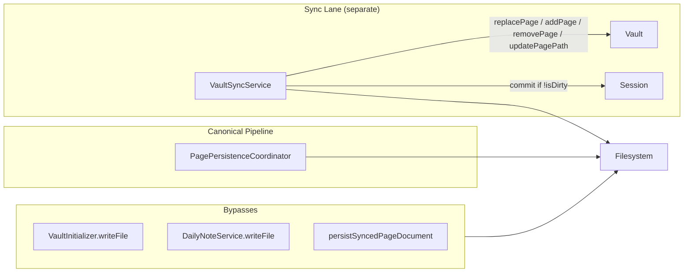
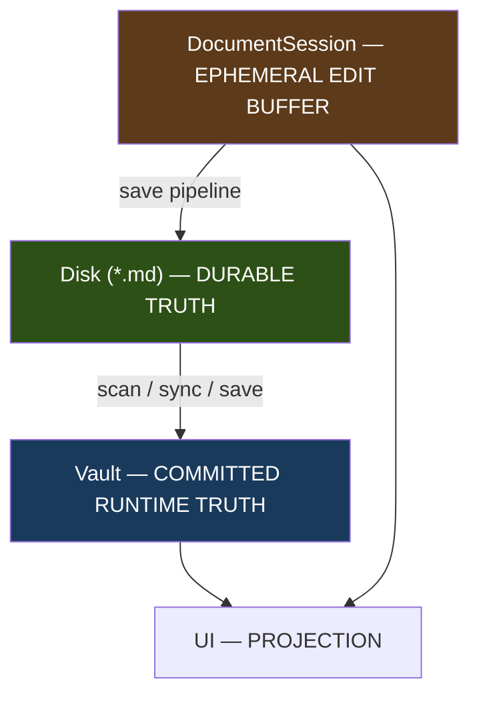

# Clutter Architecture Audit Report

**Date:** 2026-07-29  
**Scope:** Full architecture audit before further feature work  
**Method:** Manual code archaeology — traced actual code paths, cross-checked against existing docs (`docs/architecture/`), challenged stated invariants against implementation  
**Constraint:** Read-only — no code modified, no fix proposals beyond architectural direction

---

## Executive Summary

Clutter 2.0 has a **deliberate, well-documented layered architecture** that is largely implemented as designed: Markdown on disk is the durable source of truth; the Vault is an in-memory rebuildable knowledge model; editing flows through DocumentSession → Application services → PagePersistenceCoordinator → disk → rebuild → Vault. The separation between Vault (committed knowledge), DocumentSession (live buffer), and Workspace (navigation) is real and mostly respected in the UI.

However, the foundation has **critical gaps** that will block a serious local-first knowledge management application if not addressed before scaling features:

1. **Identity is not reliably stable** — path-derived IDs break rename/move; frontmatter ID edits on disk are ignored at runtime; duplicate IDs crash the app.
2. **Filesystem sync is incomplete** — folders are never synced after startup; external moves skip content rebuild; missed watcher events have no reconciliation.
3. **Two parallel write pipelines** — app writes (`PagePersistenceCoordinator`) and sync repair (`persistSyncedPageDocument`) duplicate logic without shared locking.
4. **DocumentSession carries a frozen Page snapshot** that creates latent dual-source-of-truth risks as features grow.
5. **Scale assumptions are unproven** — full vault scan on startup, O(n) projection rebuild per edit, full markdown held in memory.

The architecture is **directionally correct** — closer to Obsidian's local-first model than Notion's server-authoritative model — but several invariants documented in `docs/architecture/Vault.md` are **not yet true in code**. This report maps what is correct, what is fragile, and what must change before the foundation can support years of feature growth.

---

## Table of Contents

1. [Current Architecture Map](#1-current-architecture-map)
2. [Source of Truth Audit](#2-source-of-truth-audit)
3. [Identity Architecture](#3-identity-architecture)
4. [Persistence Pipeline](#4-persistence-pipeline)
5. [Vault Architecture](#5-vault-architecture)
6. [Filesystem Sync Architecture](#6-filesystem-sync-architecture)
7. [Reactive UI Architecture](#7-reactive-ui-architecture)
8. [DocumentSession Architecture](#8-documentsession-architecture)
9. [Domain Boundaries](#9-domain-boundaries)
10. [Comparison with Mature Applications](#10-comparison-with-mature-applications)
11. [What Is Correct](#11-what-is-correct)
12. [What Is Fragile](#12-what-is-fragile)
13. [What Will Break at Scale](#13-what-will-break-at-scale)
14. [Hidden Technical Debt](#14-hidden-technical-debt)
15. [Findings by Classification](#15-findings-by-classification)
16. [Architecture v1.1 Proposal](#16-architecture-v11-proposal)

---

## 1. Current Architecture Map

### 1.1 Layer Overview



### 1.2 Tech Stack

| Layer | Technology |
|-------|------------|
| UI | React 18, CSS design tokens, hand-rolled subscribe hooks |
| Build | Vite 6, TypeScript 5, npm workspaces |
| Desktop | Tauri 2, `@tauri-apps/plugin-fs` |
| FS watcher | Rust `notify` crate, macOS FSEvents |
| State | No Redux/Zustand — framework-agnostic `Observable` + React adapters |

### 1.3 Boot Sequence

```
Application.open(vaultPath)
  1. SelfWriteRegistry + SelfWriteAwareFileSystem
  2. VaultInitializer — ensure .clutter/, Archive/, Inbox/, Daily Notes/, workspace.json
  3. DailyNoteService.ensureToday() — may writeFile (bypasses persistence coordinator)
  4. VaultScanner.scan() — full recursive walk
  5. VaultBuilder.build() — construct Vault in memory
  6. reconcileVaultArchiveMetadata() — repair pass for all pages
  7. Wire services, start LocalFileSystemWatcher
  8. VaultSyncService subscribes to watcher
  9. pageService.openPage(today's daily note)
```

**Key file:** `apps/app/src/core/application/Application.ts`

### 1.4 Vault Pipeline (Discover → Understand → Build → Knowledge)

| Stage | Module | Output |
|-------|--------|--------|
| Discover | `VaultScanner` | Scanned directories + page file paths |
| Understand | `DocumentLoader`, `FrontmatterParser`, `MarkdownAnalyzer` | Parsed frontmatter, body, analysis |
| Build | `PageBuilder`, `VaultBuilder`, `IdentityResolver` | Immutable `Page`, `Folder`, `Vault` |
| Knowledge | `VaultProjectionBuilder`, `KnowledgeGraphBuilder` | Tags, tasks, embeds, graph edges |

Per-page mutation refresh uses `PageRebuilder` (not full rescan).

---

## 2. Source of Truth Audit

For each major data type: **durable truth** (disk), **runtime truth** (in-memory), **mutators**, **readers**, **stale copy risk**.

### 2.1 Pages

| Aspect | Detail |
|--------|--------|
| **Durable truth** | `*.md` files — YAML frontmatter + markdown body |
| **Runtime truth** | `Vault.pagesById` → `Page` objects; open pages also have `DocumentSession.currentRevision.markdown` |
| **Who mutates durable** | `PagePersistenceCoordinator` (app saves, archive, restore); `DailyNoteService.ensureToday()` (bootstrap); `persistSyncedPageDocument()` (sync repair); `VaultInitializer` (reserved files) |
| **Who mutates runtime** | `Vault.replacePage/addPage/removePage/updatePagePath`; `DocumentSession.commit()` |
| **Who reads** | PageHost (Vault + session), sidebar tree (`VaultQuery`), tasks/tags panels (`vault.tasks()`, `vault.tags()`) |
| **Stale copies?** | **Yes.** While editing: session markdown is ahead of Vault; sidebar projections read Vault only. After external sync with dirty session: Vault and session diverge. `session.page` snapshot never refreshes. |

### 2.2 Folders

| Aspect | Detail |
|--------|--------|
| **Durable truth** | Directory structure + optional `.folder.md` per folder |
| **Runtime truth** | `Vault.foldersById`, `Vault.foldersByPath` |
| **Who mutates durable** | `VaultInitializer` only (creates reserved folders). **No folder write service exists.** |
| **Who mutates runtime** | Startup scan only; `Vault.moveFolder()` exists but has no application caller for external changes |
| **Who reads** | Notes sidebar tree (`VaultQuery.getVisibleRootFolders`, `getChildFolders`) |
| **Stale copies?** | **Yes — high risk.** Folders discovered only at startup. External folder create/delete/rename is never synced. New pages in externally-created folders are silently ignored by `VaultSyncService.handleCreated()`. |

### 2.3 Tags

| Aspect | Detail |
|--------|--------|
| **Durable truth** | Inline `#tag` syntax in markdown bodies (not a separate index file) |
| **Runtime truth** | `Page.analysis.tags` (per-page) + `Vault.tagsByName` (vault-wide projection) |
| **Who mutates durable** | Indirectly via page content saves |
| **Who mutates runtime** | `Vault.refreshProjections()` on every page mutation — full O(n) rebuild from all pages |
| **Who reads** | Tags sidebar (`vault.tags()`) |
| **Stale copies?** | Projections lag unsaved session edits. After save/sync, projections are consistent (rebuilt from Vault pages). |

### 2.4 Tasks

| Aspect | Detail |
|--------|--------|
| **Durable truth** | `- [ ]` / `- [x]` syntax in markdown |
| **Runtime truth** | `Page.analysis.tasks` + `Vault.taskList` projection |
| **Who mutates durable** | Page content saves |
| **Who mutates runtime** | `Vault.refreshProjections()` — same as tags |
| **Who reads** | Tasks sidebar (`vault.tasks()`) |
| **Stale copies?** | Same as tags — lags unsaved edits. **Note:** `refreshProjections()` was added after an earlier audit flagged stale taskList; this is now fixed for committed changes. |

### 2.5 Daily Notes

| Aspect | Detail |
|--------|--------|
| **Durable truth** | `Daily Notes/YYYY/MM/DD-MM-YYYY.md` with frontmatter `type: daily-note` |
| **Runtime truth** | Regular `Page` in Vault, filtered by type |
| **Who mutates durable** | `DailyNoteService.ensureToday()` writes initial file; subsequent edits via persistence pipeline |
| **Who mutates runtime** | Same as pages |
| **Who reads** | Daily Notes sidebar (`vault.dailyNotes()`), PageHost |
| **Stale copies?** | Same as pages. Daily note body in sidebar is display-only (no live preview of unsaved content). "Start your day" button is not wired. |

### 2.6 Templates

| Aspect | Detail |
|--------|--------|
| **Durable truth** | **Not implemented.** No template files, no template registry. |
| **Runtime truth** | None |
| **Who mutates** | N/A |
| **Who reads** | Mock data only (`features/notes/mock/`) |
| **Stale copies?** | N/A |

`PageFactory` explicitly does not choose templates. `PageCreator.create()` produces empty body by default.

### 2.7 Search Indexes

| Aspect | Detail |
|--------|--------|
| **Durable truth** | None — search is not implemented |
| **Runtime truth** | None |
| **Who reads** | `Sidebar.Search.tsx` — placeholder ("Work inprogress...") |
| **Stale copies?** | N/A |

When built, search should be a **derived, disposable** index rebuilt from Vault pages — consistent with the Vault philosophy.

### 2.8 Backlinks

| Aspect | Detail |
|--------|--------|
| **Durable truth** | Derived from `[[wiki-links]]` in markdown — no separate backlink store |
| **Runtime truth** | `KnowledgeGraph.edges` (outgoing links only); backlinks **not derived** |
| **Who mutates runtime** | `Vault.refreshProjections()` → `KnowledgeGraphBuilder` |
| **Who reads** | Nothing in UI queries `vault.knowledgeGraph` yet |
| **Stale copies?** | Backlinks TODO in `KnowledgeGraph.ts` and `KnowledgeGraphBuilder.ts`. Graph exists but is unused. |

### 2.9 Metadata

| Aspect | Detail |
|--------|--------|
| **Durable truth** | YAML frontmatter fields: `id`, `type`, `created`, `modified`, `favorite`, `icon`, `cover`, `description`, `status`, `archivedAt`, `originalPath`, `originalParentId` |
| **Runtime truth** | `Page.metadata` / `Folder.metadata` |
| **Who mutates durable** | Side effect of page saves via `FrontmatterSerializer.serializePage()` |
| **Who mutates runtime** | `PageRebuilder.rebuild()` re-reads frontmatter on every save/sync |
| **Who reads** | PageHost headers, favorites filter, archive policy |
| **Stale copies?** | **Partial.** Archive metadata can be auto-repaired by sync (`ArchiveMetadataReconciler`). Title/description/icon/favorite edits have UI hooks but most throw "Not implemented". `aliases` parsed from frontmatter but **not serialized back** on save. `modified` timestamp not explicitly updated on content-only saves. |

### 2.10 Assets

| Aspect | Detail |
|--------|--------|
| **Durable truth** | Image/media files in vault (e.g. `cover.png` referenced in frontmatter) |
| **Runtime truth** | **Not indexed.** `VaultScanner` only processes `*.md` and `.folder.md`. |
| **Who mutates** | External tools only |
| **Who reads** | Cover URLs passed through as strings — no asset registry, no watcher |
| **Stale copies?** | Asset deletion/rename not tracked. Broken cover references would persist silently. |

### 2.11 Workspace / Navigation State

| Aspect | Detail |
|--------|--------|
| **Durable truth** | `.clutter/workspace.json` — created as `{}` by `VaultInitializer`, **never read or written by application code** |
| **Runtime truth** | `Workspace` — active page/folder, open pages, expanded folders |
| **Who mutates** | `Workspace` methods via application services |
| **Who reads** | PageHost, sidebar (partially — no active-page highlighting in tree) |
| **Stale copies?** | Lost on app restart. No persistence of tabs, expanded state, or last-opened page. |

---

## 3. Identity Architecture

### 3.1 Page IDs

**Resolution:** `IdentityResolver.resolve()` in `apps/app/src/core/vault/build/IdentityResolver.ts`

```
if frontmatter.id exists → { id: frontmatter.id, source: 'frontmatter' }
else                     → { id: absolutePath,   source: 'derived' }
```

| Source | Stable across rename? | Stable across move outside Clutter? |
|--------|----------------------|-------------------------------------|
| `frontmatter` | **Yes** — ID preserved; path updated via `updatePagePath` | **Yes** — if frontmatter travels with file |
| `derived` (path) | **No** — ID is the old absolute path | **No** — ID becomes orphaned |

**New pages:** `PageCreator` generates UUID via `UuidGenerator`, embeds in frontmatter before first write.

**Rebuild behavior:** `PageRebuilder.rebuild()` **always preserves `page.id`** from the existing runtime page — never re-reads frontmatter `id`. If an external tool changes the `id` field on disk, Vault and disk disagree silently.

**Duplicate IDs:** `Vault` constructor throws `Duplicate page ID`. Runtime `addPage()` throws `Page already exists`. No repair strategy.

### 3.2 Folder IDs

Same resolution mechanism as pages. Stored in `.folder.md` frontmatter if present, else path-derived.

Folders have **no sync path** after startup — folder identity in Vault can become permanently wrong if folders are created/renamed/deleted externally without restart.

### 3.3 Path Identity vs Filename Identity

| Concept | Role | Mutable? |
|---------|------|----------|
| `Page.id` | Primary key — frontmatter UUID or path fallback | Immutable at runtime |
| `Page.path` | Secondary index — current filesystem location | Updated on move/rename |
| `Page.name` | Display name — derived from filename at build time | **Not updated** on external rename (`PageRebuilder` preserves `page.name`) |

There is **no display-name-in-frontmatter** path. Filename = display name, always.

### 3.4 External Moves, Renames, Imports

| Scenario | Handler | Identity preserved? | Content rebuilt? | Name updated? |
|----------|---------|--------------------|--------------------|---------------|
| App-initiated archive/restore | `PagePersistenceCoordinator` | Yes | Yes (full round-trip) | Yes (path changes) |
| External content edit | `VaultSyncService.handleChanged` | Yes | Yes | No |
| External move/rename | `VaultSyncService.handleMoved` | Yes (if known page) | **No** — path/parent only | **No** |
| External new file | `VaultSyncService.handleCreated` | New ID from frontmatter or path | Yes (full build) | Yes |
| External delete | `VaultSyncService.handleDeleted` | Removed from Vault | N/A | N/A |
| Import without frontmatter ID | `PageBuilder.build()` | Path-derived — fragile | Yes | Yes |

### 3.5 Answering the Identity Questions

**Can a page survive a rename?**
- With frontmatter ID: **Yes** — runtime ID preserved, path updated.
- With path-derived ID: **No** — the ID *is* the old path; after rename the page is effectively a different entity unless full rescan occurs.

**Can it survive a move outside Clutter?**
- With frontmatter ID: **Yes**, if the file is moved back into the watched vault root and the watcher fires.
- Moves outside the watched root appear as `deleted` (unpaired rename "from" half).

**Can Obsidian/VS Code/Git style workflows work?**
- **Partially.** Content edits sync. Renames mostly work (with name drift). Git merge conflicts on frontmatter IDs would crash startup (duplicate ID). Files without frontmatter IDs break on rename. Folder operations outside the app are invisible until restart. No `.gitignore` or exclusion list in scanner.

**What happens after corruption?**
- Duplicate IDs → startup failure (throws).
- Missing frontmatter → path-derived identity (fragile).
- Changed frontmatter ID on disk → ignored at runtime (Vault keeps old ID).
- No user-facing corruption recovery UI. Only remedy: fix files manually + restart.

---

## 4. Persistence Pipeline

### 4.1 Intended Pipeline

```
User Intent
  ↓
Application Service (PageApplicationService / PageMutationService)
  ↓
DocumentSession.commit() [edit saves only]
  ↓
SaveCoordinator.beginSave()
  ↓
PersistenceService.save()
  ↓
PagePersistenceCoordinator.enqueue()
  ↓
  operate(current Page from Vault) → { page, markdown }
  ↓
  MoveService.movePage() [if path changed]
  ↓
  FrontmatterSerializer.serializeDocument()
  ↓
  VaultFileSystem.writeFile()
  ↓
  FrontmatterParser.parse() → PageRebuilder.rebuild()
  ↓
  Vault.replacePage()
  ↓
  Vault.refreshProjections()
  ↓
SaveCoordinator.completeSave() / failSave()
  ↓
UI re-render (useVault / useDocumentSession)
```

### 4.2 Write Paths — Traced

| Write path | Status | Entry point | Goes through coordinator? |
|------------|--------|-------------|----------------------------|
| Edit save | **Implemented** | `PageApplicationService.updateMarkdown` | Yes |
| Archive | **Implemented** | `PageMutationService.archivePage` | Yes |
| Restore | **Service only** | `PageMutationService.restorePage` | Yes — no UI |
| Rename | **Not implemented** | `PageApplicationService.renamePage` throws | — |
| Move (user) | **Not implemented** | — | — |
| Template insert | **Not implemented** | — | — |
| Metadata-only edit | **Not implemented** | UI hooks throw | — |
| Daily note bootstrap | **Bypass** | `DailyNoteService.ensureToday` | No — direct `writeFile` |
| Reserved file init | **Bypass** | `VaultInitializer.ensureFile` | No — before Vault exists |
| Sync archive repair | **Bypass** | `persistSyncedPageDocument` | No — duplicates coordinator logic |

### 4.3 Bypasses Found



**Critical inconsistency:** `MoveService.movePage()` calls `vault.updatePagePath()` **before** the file write completes. If the write fails after the move, Vault has the new path but disk may still hold the file at the old path.

### 4.4 Coordinator Locking

| Coordinator | Scope | Used by |
|-------------|-------|---------|
| `PagePersistenceCoordinator` | Per-page write queue | App saves, archive, restore |
| `VaultSyncCoordinator` | Per-page/path exclusive ops | External FS events |

These two coordinators **do not share a lock**. Coordination relies entirely on `SelfWriteRegistry` echo suppression — not on a unified write mutex. A race between an in-flight app save and an external change to the same file is theoretically possible.

---

## 5. Vault Architecture

### 5.1 Lifecycle

| Phase | Operation | Full or incremental? |
|-------|-----------|------------------------|
| Startup | `VaultScanner.scan()` + `VaultBuilder.build()` | Full |
| App save | `PagePersistenceCoordinator` → `replacePage` | Per-page |
| External sync | `VaultSyncService` handlers | Per-page (except move = path only) |
| Teardown | `Application.close()` — stop watcher, dispose sync, clear sessions | — |
| Runtime rescan | **Does not exist** | — |

### 5.2 Is Vault Always Rebuildable from Disk?

**By design: yes.** `docs/architecture/Vault.md` states: *"The Vault can always be rebuilt from the contents of the vault folder."*

**In practice:** Yes, via full restart (`Application.open()` re-scans). No hot "rebuild vault" command. No incremental reconciliation against disk if watcher misses events.

### 5.3 Can Vault Drift from Disk?

**Yes — multiple drift vectors:**

| Drift vector | Mechanism | Detection | Recovery |
|--------------|-----------|-----------|----------|
| Missed watcher events | No periodic reconciliation | None | Restart |
| Folder changes ignored | No folder sync | Silent | Restart |
| External move shallow update | `handleMoved` skips content re-read | None | Manual re-open or restart |
| Frontmatter ID change on disk | `PageRebuilder` preserves runtime ID | None | Restart (re-scan uses frontmatter ID for new build, but open session keeps old) |
| Path-derived ID after rename | ID ≠ path after move | Broken lookups possible | Restart or manual ID fix |
| Dirty session + external change | Vault updated, session not | User sees stale editor content | Save overwrites or user refreshes |
| Failed sync swallowed | `dispatch().catch(console.error)` | Console only | None automatic |

### 5.4 Derived Indexes — Disposable?

| Index | Disposable? | Rebuild trigger | Cost |
|-------|-------------|-----------------|------|
| `pagesById` / `pagesByPath` | Yes | Per-page mutation | O(1) |
| `foldersById` / `foldersByPath` | Yes | Startup only today | — |
| `tagsByName` | Yes | `refreshProjections()` | O(n pages) |
| `taskList` | Yes | `refreshProjections()` | O(n pages) |
| `embedList` | Yes | `refreshProjections()` | O(n pages) |
| `knowledgeGraph` | Yes | `refreshProjections()` | O(n pages × links) |
| `PageIndex` (internal) | Yes | Built inside `KnowledgeGraphBuilder.build()` | O(n) per projection refresh |

Projections are correctly treated as disposable and rebuilt from Pages. The O(n) cost per single-page edit is acceptable at small scale but will not hold at thousands of pages.

### 5.5 Mutations — Safe?

| Mutation | Validates? | Notifies UI? | Rebuilds projections? |
|----------|-----------|--------------|----------------------|
| `replacePage` | Throws if unknown ID; asserts path available | `page-changed` or `page-moved` | Yes |
| `addPage` | Throws on duplicate ID/path | `page-added` | Yes |
| `removePage` | Throws if unknown | `page-removed` | Yes |
| `updatePagePath` | Asserts path available | `page-moved` | Yes — but shallow (no content re-parse) |
| `moveFolder` | Validates path conflicts | `folder-moved` | No page projection impact |

Vault mutations are **internally consistent** — projections cannot drift from Pages after mutation. The risk is drift between Vault and **disk**, not between Vault indexes.

---

## 6. Filesystem Sync Architecture

### 6.1 Event Pipeline

```
OS filesystem event (notify/FSEvents)
  ↓
vault_watcher.rs — classify, pair renames (300ms window)
  ↓
Tauri emit: vault:file-change { type, path, fromPath?, toPath? }
  ↓
LocalFileSystemWatcher — forward to subscribers
  ↓
SelfWriteAwareWatcher — filter self-write echoes
  ↓
VaultSyncService.handleChange()
  ↓
VaultSyncCoordinator.runExclusive(key)
  ↓
Read actual disk state (handleChanged/Created only)
  ↓
Interpret → update Vault (+ optionally DocumentSession)
```

### 6.2 Watcher Capabilities and Limits

| Capability | Status | Detail |
|------------|--------|--------|
| Create detection | Yes | New `.md` files |
| Content change | Yes | Re-reads and rebuilds page |
| Delete detection | Yes | Removes from Vault |
| Move/rename detection | Best-effort | 300ms pairing window; no FSEvents cookie on macOS |
| Duplicate events | Partially handled | `handleCreated` skips if path already known |
| Missed events (app closed) | **Not handled** | No startup reconciliation diff |
| Cloud sync (iCloud/Dropbox) | **Untested** | Rapid create/delete/move bursts may confuse pairing |
| Git operations | **Partial** | Checkout changing many files → many events, no batching |
| Self-write suppression | Yes | `SelfWriteRegistry` — but `deleted` events never suppressed |
| Folder events | **Ignored** | Only `.md` files processed |

### 6.3 Dependency on Unreliable Events

**The system partially depends on events without mandatory disk reconciliation.**

- `handleMoved` trusts the paired from/to paths — does not re-read file content or verify frontmatter.
- `handleCreated` requires parent folder to already exist in Vault — fails silently otherwise.
- No "read disk and diff against Vault" fallback exists.

**Principle violated:** Mature local-first apps (Obsidian) treat the watcher as an optimization and periodically verify disk state, or use mtime-based reconciliation on focus/resume.

### 6.4 App-Closed Changes

When the app is closed, all filesystem changes are invisible. On next startup, `VaultScanner.scan()` rebuilds from disk — **this is the recovery mechanism**. Watcher gaps during runtime have no equivalent recovery except restart.

---

## 7. Reactive UI Architecture

### 7.1 Subscription Model

```
Application (held in React useState in AppShell)
  ├── Vault.subscribe()        → useVault()        → AppLayout re-render
  ├── Workspace.subscribe()    → useWorkspace()    → PageHost re-render
  └── DocumentSession.subscribe() → useDocumentSession() → PageHost re-render
```

No React Context for domain state. Sidebar inherits re-renders from AppLayout's `useVault` — does not subscribe independently.

### 7.2 UI Surface Audit

| Surface | Data source | Subscribes? | Can go stale? | Should read Vault or Session? |
|---------|-------------|-------------|---------------|-------------------------------|
| **PageHost** | Vault (structure) + Session (markdown) + Workspace (navigation) | Yes — all three | Dual-source during dirty edit | Both — correct split |
| **Sidebar shell** | Pass-through `application.vault` | Indirect only | If mounted outside AppLayout | Vault |
| **Notes tree** | `VaultQuery` over Vault | Indirect | Yes — unsaved edits invisible | Vault (committed state) |
| **Favorites** | `VaultQuery.getFavorites()` | Indirect | Same | Vault |
| **Tasks panel** | `vault.tasks()` | Indirect | **Yes — unsaved task edits invisible** | Vault until save; ideally session overlay for open page |
| **Tags panel** | `vault.tags()` | Indirect | Same as tasks | Vault |
| **Daily Notes panel** | `vault.dailyNotes()` | Indirect | Same | Vault |
| **Search** | None | No | N/A | Derived index (future) |
| **Folder page** | `VaultQuery` children | Indirect | Structural only | Vault |
| **MarkdownEditor** | Session markdown via props | Via PageHost | DOM buffer vs prop sync risk | Session |

### 7.3 Staleness Risks (Ranked)

1. **Sidebar projections vs unsaved edits** — Tasks/Tags read Vault; editor writes to Session. Expected for committed-state panels, but no visual indicator of staleness.
2. **`session.page` frozen snapshot** — Safe today because UI reads structure from Vault; latent risk as features grow.
3. **VaultSyncService → session.commit bypass** — Second edit pipeline entry point.
4. **MarkdownEditor DOM sync** — `useEffect` can overwrite in-progress typing when parent re-renders.
5. **Deleted page with open session** — `handleDeleted` removes from Vault; no session cleanup; PageHost throws on next render.
6. **No active-page highlighting in tree** — Sidebar lacks `useWorkspace`.
7. **Save state not surfaced** — `DocumentState.Saving/SaveError` not shown in UI.

---

## 8. DocumentSession Architecture

### 8.1 What It Owns Today

| Owned | Purpose | Correct? |
|-------|---------|----------|
| `Page` snapshot (frozen at open) | Identity binding (`session.page.id`) | **Questionable** — should own `pageId` only |
| `currentRevision.markdown` | Live editor buffer | Yes |
| `savedRevision` | Last persisted revision pointer | Yes |
| `DocumentState` | Clean / Saving / SaveError | Yes |
| Revision counter | Monotonic edit tracking | Yes |
| Undo history | **Not implemented** | Future |
| `attachedViews` | Declared but unused | Dead code |

### 8.2 What It Should Own (Target)

Per the audit mandate:

```
DocumentSession should own:
  - pageId (stable reference, not full Page snapshot)
  - editor buffer (currentRevision.markdown)
  - undo history (future)
  - save state (savedRevision, DocumentState)
```

Everything structural (path, metadata, analysis) should be read from Vault at render time.

### 8.3 Hidden Source-of-Truth Risks

| Risk | Location | Current mitigation | Future failure mode |
|------|----------|-------------------|---------------------|
| Frozen `session.page.path` | `DocumentSession._page` | Services use `session.page.id`; UI reads Vault | Feature reads `session.page.metadata` → stale archive status |
| Dual markdown | Session vs Vault | Projections read Vault | Sidebar shows old tasks while editor has new ones |
| Sync commits to session | `VaultSyncService` lines 165–168, 228–231 | Skips if dirty | Clean session gets external content without user awareness |
| No session refresh after save | `PersistenceService` | Vault updated; session only `markSaved` | `session.page.source.markdown` permanently stale |
| No session disposal on delete | `VaultSyncService.handleDeleted` | None | Crash on render |

---

## 9. Domain Boundaries

### 9.1 Intended Boundaries

| Rule | Intended |
|------|----------|
| MoveService knows about archive | **No** — generic filesystem move only |
| Sync knows user intent | **No** — reacts to disk, doesn't interpret user actions |
| UI mutates Vault directly | **No** — goes through application services |
| Queries mutate state | **No** — read-only |

### 9.2 Violations Found

| Violation | Severity | Detail |
|-----------|----------|--------|
| Sync encodes archive **policy** | Important | `ArchiveMetadataReconciler` auto-clears `status: archived` when page is outside `Archive/` folder — lifecycle repair without user intent |
| Sync writes to disk | Important | `persistSyncedPageDocument` is a parallel write pipeline |
| Sync mutates DocumentSession | Important | `session.commit()` bypasses `PageApplicationService` |
| Sync mutates Vault directly | Acceptable | By design for external changes — but should not also write |
| DailyNoteService writes directly | Important | Bootstrap bypasses coordinator; documented as temporary |
| VaultInitializer writes directly | Acceptable | Pre-Vault bootstrap |
| `MoveService` called mid-pipeline with pre-write Vault mutation | Important | Path updated before disk confirms |

### 9.3 Non-Violations Confirmed

- UI does **not** call `vault.replacePage()` or similar directly
- `VaultQuery` is read-only
- `MoveService` has no archive concepts — archive logic correctly in `PageMutationService`
- `PagePersistenceCoordinator` does not know about DocumentSession

---

## 10. Comparison with Mature Applications

Extracted **principles**, not implementation copies.

### 10.1 Obsidian

| Principle | Obsidian | Clutter today | Gap |
|-----------|----------|---------------|-----|
| Markdown is source of truth | Yes | Yes | Aligned |
| Stable internal IDs | Uses file path as primary key; rename = different file from app's view | Frontmatter UUID (better!) but path fallback breaks this | Fix path-derived IDs |
| Vault = cache of disk | Yes, rebuildable | Yes, at startup | Need runtime reconciliation |
| Watcher + periodic sync | Watcher + reconcile on focus | Watcher only | Add reconciliation |
| MetadataCache | Full parse cache with mtime invalidation | Full in-memory, no mtime tracking | Add mtime-based skip |
| Backlinks | Derived from indexed links | Graph edges exist, backlinks TODO | Implement derivation |
| No write coordination | Last writer wins | Per-page queue (better for same file) | Good — keep |

### 10.2 VS Code

| Principle | VS Code | Clutter today | Gap |
|-----------|---------|---------------|-----|
| Buffer ≠ disk model | TextDocument separate from file | DocumentSession ≠ Vault Page | Aligned conceptually |
| Dirty indicator | Always visible | Not shown | Add save state UI |
| File watcher with revert | Prompt on external change | Auto-merge if clean, skip if dirty | Consider user prompt |
| Extension host isolation | Core/editor/UI separated | Clean layer separation | Aligned |

### 10.3 Bear / Craft / Notion

| Principle | Bear/Craft | Notion | Clutter |
|-----------|------------|--------|---------|
| Local-first | Bear yes; Craft/Notion cloud-first | Server authoritative | Local-first — closer to Bear |
| Block-level identity | Bear: note-level; Notion: block UUIDs | Block IDs | Page-level only — block refs parsed but not identity-bearing |
| Sync conflict resolution | Varies | OT/CRDT | None — last writer wins |

**Principle to adopt:** Bear's simplicity (note = file, tags inline) aligns with Clutter. Notion's block-level identity is overkill until Clutter needs transclusion or block-level linking.

### 10.4 Extracted Principles for Clutter

1. **Disk is authoritative; Vault is a cache** — always be able to rebuild, and detect when cache is stale.
2. **Identity must survive filesystem operations** — frontmatter UUID is the right choice; eliminate path fallback.
3. **Separate buffer state from committed state** — DocumentSession owns buffer; Vault owns committed; UI must know which it reads.
4. **Watcher is an optimization, not a guarantee** — reconcile on startup/resume/focus.
5. **Derived indexes are disposable** — correct approach; optimize rebuild cost later.
6. **User intent flows through application services** — sync reacts, never initiates lifecycle changes.

---

## 11. What Is Correct

These architectural decisions are sound and should be preserved:

1. **Layered architecture** — Vault / Engine / Application / UI separation is real, not just documentation.
2. **Discover → Understand → Build → Knowledge pipeline** — clean, testable, extensible.
3. **PagePersistenceCoordinator as single write owner** — per-page queue with latest-Vault-read is the right pattern.
4. **PageRebuilder separate from PageBuilder** — rebuild after mutation vs build at discovery is correctly separated.
5. **Self-write suppression** — `SelfWriteRegistry` prevents sync echo loops.
6. **Frontmatter UUID for new pages** — `PageCreator` + `UuidGenerator` is the right long-term identity strategy.
7. **Disposable projections with full rebuild** — `Vault.refreshProjections()` prevents index drift (fixed since earlier review).
8. **Archive as metadata + folder convention** — `status: archived` with `Archive/` folder is flexible.
9. **Framework-agnostic core** — Observable pattern keeps domain testable without React.
10. **Rust watcher with rename pairing** — pragmatic solution for FSEvents limitations.
11. **Immutable Page/Folder models** — replace, don't mutate, prevents subtle bugs.
12. **DocumentSession as single session per page** — `DocumentRegistry` lazy open is correct.

---

## 12. What Is Fragile

| Area | Fragility | Trigger |
|------|-----------|---------|
| Path-derived IDs | Identity breaks on rename | Legacy/imported markdown without frontmatter ID |
| Folder sync absence | New pages in new folders invisible | User creates folder in Finder, adds note |
| External move handler | Name/metadata/analysis stale after rename | Rename in Obsidian/VS Code |
| Dual write pipelines | Divergent behavior between app and sync repair | Archive metadata reconciliation during active edit |
| DocumentSession Page snapshot | Latent stale reads | Any feature reading `session.page.*` beyond ID |
| No rename/move UI | Users must use external tools | Any rename triggers sync fragilities |
| Duplicate ID handling | App won't open | Git merge producing two files with same ID |
| Watcher-only runtime sync | Vault drifts if events missed | Cloud sync, rapid git checkout |
| Aliases not serialized | Data loss on save | Pages with YAML aliases |
| `workspace.json` unused | Navigation state lost on restart | Every app restart |

---

## 13. What Will Break at Scale

| Concern | Current behavior | Break point (estimate) |
|---------|-----------------|----------------------|
| Startup scan | Sequential recursive walk, reads every `.md` | ~5–30s at 10k+ files |
| Memory | Full markdown + analysis for every page in RAM | ~1GB+ at 10k large notes |
| Projection rebuild | O(n pages) on every single edit | Noticeable lag at 1k+ pages |
| Link resolution | O(pages × links) via `PageIndex` linear scans for headings/blocks | Slow graph at scale |
| Markdown analysis | 6 independent full-content passes per file | 6× parse cost at scale |
| No scan exclusions | Walks `.git`, `.clutter`, everything | Wasted I/O in mixed repos |
| No incremental index | Cannot update one page's tags without scanning all | CPU bound |
| No lazy loading | All pages loaded at startup | Memory + time |

---

## 14. Hidden Technical Debt

| Debt | Location | Impact |
|------|----------|--------|
| `tsc -p .` false negative | `tsconfig.json` references mask type errors | Real bugs invisible to CI |
| Broken imports | `MarkdownAnalyzer.ts`, `PageFrontmatter.ts` | Dead code paths |
| `LinkBuilder`/`EmbedBuilder` vs `KnowledgeGraphBuilder` | Two link pipelines | Confusion, one broken |
| `packages/engine` + `packages/editor` unused | Standalone packages | Parallel editor experiment abandoned? |
| Mock data in features | `features/notes/mock/` | UI partially wired to mocks |
| `console.log` in production paths | `PageService`, `Workspace` | Debug noise |
| `FrontmatterParser` silently drops unknown keys | Unknown YAML lost without warning | Data loss |
| `BlockReferenceExtractor` only matches line-anchored IDs | Most block refs missed | Broken block links |
| Occurrence offset fields always `undefined` | 4 occurrence types | Modeled but unused |
| `KnowledgeGraph` has no query methods | Graph built but unused | Dead investment |
| SaveCoordinator stale comments | References future persistence | Misleading docs |
| `LocalFileSystem.ts` contains `LocalVaultProvider` | Name mismatch | Discoverability |
| Hardcoded vault path in AppShell | `/Users/.../Vault` | Not production-ready |
| E2E tests may not type-check | `TS6305` from project references | CI gap |

---

## 15. Findings by Classification

### Critical — Must Fix Before Features

| ID | Finding | Rationale |
|----|---------|-----------|
| C1 | **Eliminate or migrate path-derived IDs** | Identity breaks on rename/move — undermines entire architecture |
| C2 | **Implement folder filesystem sync** | New content invisible without restart |
| C3 | **Unify write pipelines** | `persistSyncedPageDocument` must go through `PagePersistenceCoordinator` or share its logic |
| C4 | **Fix DocumentSession to own pageId only** | Frozen Page snapshot is a growing source-of-truth bug |
| C5 | **External move must re-read and rebuild** | `handleMoved` leaves name/analysis/metadata stale |
| C6 | **Duplicate ID strategy** | App crashes instead of recovering — blocks Git workflows |
| C7 | **Fix tsc/CI type checking** | Real bugs hidden |

### Important — Fix Soon

| ID | Finding | Rationale |
|----|---------|-----------|
| I1 | Implement rename/move in application layer | Core CRUD missing; forces fragile external sync |
| I2 | Add disk reconciliation on startup/resume | Safety net for missed watcher events |
| I3 | Serialize aliases in FrontmatterSerializer | Data loss on save |
| I4 | Session cleanup on page delete | Crash when external delete + open tab |
| I5 | Move archive policy out of sync layer | Sync should not encode lifecycle rules |
| I6 | Surface save state in UI | Users can't see Saving/Error/Dirty |
| I7 | Update `Page.name` on external rename | Display name drifts from filename |
| I8 | Shared lock between persistence and sync coordinators | Race window on concurrent app + external writes |
| I9 | Wire restore UI | Service exists, user can't restore |
| I10 | Persist workspace state to `.clutter/workspace.json` | Navigation lost on restart |

### Acceptable — Document Only

| ID | Finding | Rationale |
|----|---------|-----------|
| A1 | O(n) projection rebuild | Correctness over performance at current scale |
| A2 | Sidebar reads Vault not Session for tasks/tags | Correct for committed-state panels — document expected behavior |
| A3 | DailyNoteService bootstrap bypass | Documented; acceptable pre-scan |
| A4 | No template system yet | Not built — not broken |
| A5 | Search not implemented | Placeholder acknowledged |
| A6 | Assets not indexed | Covers work as strings — sufficient for now |
| A7 | Full markdown in memory | Fine for personal vaults < 1000 pages |

### Future — Defer

| ID | Finding | Rationale |
|----|---------|-----------|
| F1 | Incremental projection updates | Optimize when O(n) becomes measurable |
| F2 | mtime-based scan skip | Optimize startup |
| F3 | Scan exclusions (`.git`, etc.) | Needed at scale, not now |
| F4 | Block-level identity | Not required until transclusion |
| F5 | Backlink index + UI | Graph builder exists; UI not planned yet |
| F6 | Integrate `packages/engine` editor | Separate experiment |
| F7 | Cloud sync conflict UI | No multi-device sync yet |
| F8 | Undo/redo in DocumentSession | Engine package has history; not wired |

---

## 16. Architecture v1.1 Proposal

This proposal defines target architecture **after** completing the audit. It does not prescribe implementation details — those belong in subsequent arc documents.

### 16.1 Identity v1.1

```
Rule 1: Every page and folder MUST have a frontmatter UUID before any mutation.
Rule 2: Path-derived IDs are a one-time migration target, not a permanent identity.
Rule 3: On scan/build, if no frontmatter ID → generate UUID and queue a persistence write to embed it.
Rule 4: PageRebuilder MUST NOT preserve stale identity if frontmatter ID changed on disk — emit an identity-change event instead.
Rule 5: Duplicate IDs at startup → quarantine conflicting files, don't crash.
```

### 16.2 Source of Truth v1.1



**Invariant:** UI reads structure from Vault, buffer from Session. Never from `session.page`.

### 16.3 Persistence v1.1

**Single write lane:**

```
ALL disk writes → PagePersistenceCoordinator
  (including sync repair, daily note bootstrap, ID migration)

Exception: VaultInitializer reserved resource creation (pre-Vault)
```

**Move ordering fix:**

```
write temp → verify → move file → update Vault path → replacePage
(not: update Vault path → write)
```

### 16.4 Sync v1.1

```
Event → read disk → interpret → update Vault
         ↑ mandatory, not optional for any event type

Plus:
  - Reconcile on startup (diff Vault paths vs disk)
  - Reconcile on app focus/resume
  - Folder create/delete/rename handlers
  - handleMoved MUST re-read file content
```

Sync layer rules:
- React to disk only
- Never encode lifecycle policy (move archive reconciler to application layer)
- Never write to disk (delegate to coordinator)
- Never commit to DocumentSession (notify application layer; let it decide)

### 16.5 DocumentSession v1.1

```typescript
// Target shape (conceptual)
DocumentSession {
  pageId: string           // not full Page
  currentRevision: Revision
  savedRevision: Revision
  state: DocumentState
  // future: undoStack
}
```

Application layer provides `getPageForSession(pageId): Page | undefined` reading live Vault.

### 16.6 Vault v1.1

- Folders sync incrementally (same watcher, new handlers)
- `refreshProjections()` remains full rebuild until performance requires incremental
- Add `reconcileWithDisk()` for startup/resume safety net
- `workspace.json` persists: open tabs, expanded folders, last active page
- Reserved: mtime cache in `.clutter/` (future optimization, not source of truth)

### 16.7 Domain Boundaries v1.1

| Layer | May | Must not |
|-------|-----|----------|
| UI | Call application services, subscribe to Vault/Session/Workspace | Mutate Vault, write disk, encode business rules |
| Application | Orchestrate intent, call coordinator, manage sessions | Parse markdown, build projections |
| Engine (DocumentSession) | Own buffer + save state | Know about Vault mutations, filesystem, archive |
| Vault | Hold committed model, rebuild projections, emit events | Write disk, manage sessions, know UI |
| Sync | Read disk, propose Vault updates via application layer | Write disk, encode lifecycle policy, commit to session |
| Persistence Coordinator | Write disk, rebuild page, update Vault | Know about sessions, UI, sync |

### 16.8 Implementation Priority

```
Phase 0 (Foundation — before any feature):
  C7 → C1 → C4 → C3 → C5 → C2 → C6

Phase 1 (Core CRUD):
  I1 (rename/move) → I9 (restore UI) → I6 (save state UI)

Phase 2 (Reliability):
  I2 (reconciliation) → I8 (shared lock) → I5 (move archive policy)
  → I4 (session cleanup) → I7 (name on rename)

Phase 3 (Polish):
  I3 (aliases) → I10 (workspace persistence) → F5 (backlinks)

Phase 4 (Scale — when needed):
  F1 → F2 → F3
```

---

## Appendix A: Key File Index

| Concern | Path |
|---------|------|
| Composition root | `apps/app/src/core/application/Application.ts` |
| Vault model | `apps/app/src/core/vault/models/Vault.ts` |
| Identity | `apps/app/src/core/vault/build/IdentityResolver.ts` |
| Page rebuild | `apps/app/src/core/vault/build/PageRebuilder.ts` |
| Write pipeline | `apps/app/src/core/application/persistence/PagePersistenceCoordinator.ts` |
| Sync | `apps/app/src/core/vault/sync/VaultSyncService.ts` |
| Watcher (Rust) | `apps/app/src-tauri/src/vault_watcher.rs` |
| Document session | `apps/app/src/core/engine/DocumentSession.ts` |
| React adapters | `apps/app/src/app/hooks/useVault.ts`, `useDocumentSession.ts`, `useWorkspace.ts` |
| PageHost | `apps/app/src/app/layouts/page/PageHost.tsx` |
| Architecture docs | `docs/architecture/Vault.md`, `Core Review.md` |

## Appendix B: Existing Docs vs Reality

| Document claim | Reality (2026-07-29) |
|----------------|---------------------|
| "Vault never performs filesystem writes" | Violated by design — `VaultInitializer`, `DailyNoteService` write pre-scan |
| "Invariant 6: identities stable across rename" | **Not true** for path-derived IDs — acknowledged in Vault.md |
| "SaveCoordinator unimplemented" (Engine.md) | **Implemented** — docs lag |
| "taskList goes stale after edit" (Arch Review v1.1) | **Fixed** — `refreshProjections()` on every mutation |
| "PageRebuilder pipeline" (Arc 5) | **Implemented** and tested |

---

*End of report. This document is the authoritative output of the architecture audit phase. Implementation should not begin on new features until Critical findings (C1–C7) have an agreed remediation plan.*
