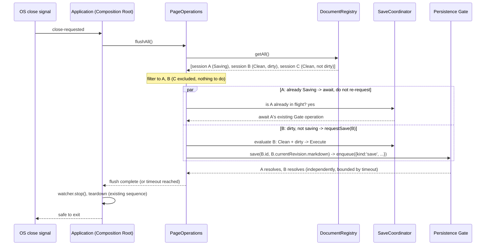
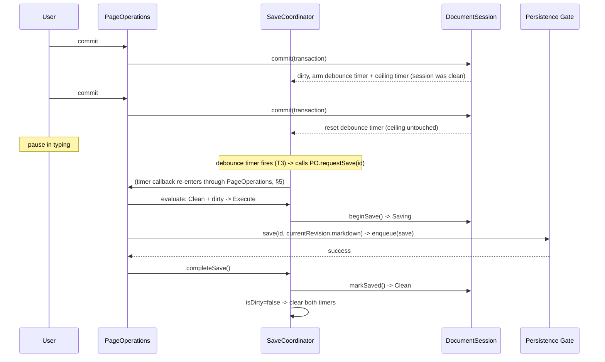
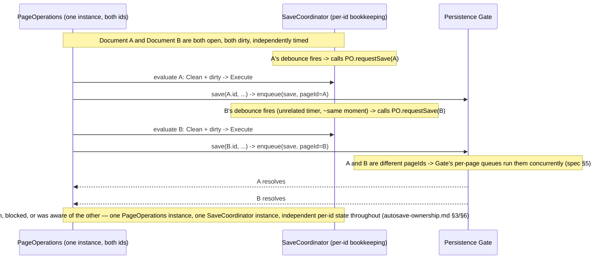

# Autosave — Execution Model

**Status:** Research only, but written to be frozen. No code changes. This is the third and final document of the Autosave milestone's pre-implementation series — [`autosave-strategy-analysis.md`](./autosave-strategy-analysis.md) established *what* the trigger model should be and *why*; [`autosave-ownership.md`](./autosave-ownership.md) established *which subsystem owns each moving part*; this document defines *exactly how execution proceeds*, precisely enough that implementation is translation, not design. Where this document introduces new mechanism, it names the owner from `autosave-ownership.md` explicitly rather than re-deriving ownership.

This document uses `docs/durability-model.md`'s Committed/Durable/Reconciled vocabulary and assumes the reader has both prior documents in hand. It does not re-argue product research or ownership — both are treated as settled inputs.

---

## 0. Vocabulary this document depends on

Two terms are introduced here because the rest of the document is unreadable without them, and getting them precise is most of what makes §4 (coalescing) tractable at all.

- **Trigger**: a raw event from the outside world — a keystroke, a debounce timer firing, a blur event, a navigation action, an application-close signal, a manual save command, a future plugin call. Triggers are plural, cheap, and uncoordinated by nature.
- **Save request**: what a trigger produces when it asks the system to make a session durable. **A save request carries no payload.** It is not "please write this markdown" — it is "please ensure this session's current revision is durable, if it isn't already." This is the single most load-bearing design decision in this document, and everything in §4 follows from it: because a save request has no content of its own, two save requests for the same session are, by definition, requests for the *same thing* — there is nothing to compare, merge, or reconcile between them beyond "has this already been satisfied or subsumed." Staleness, duplication, and coalescing all reduce to one question — *is the session's current revision already durable, already in flight, or neither* — instead of N different questions about N different pieces of content.

Contrast with today's shipped code (`autosave-strategy-analysis.md` §0): `MarkdownEditor`'s blur handler currently *does* carry a payload — it reads `editor.textContent` and passes it through `onCommit`/`updateMarkdown`/`save(id, markdown)` as an argument. That remains correct and unchanged for the *commit* step (§1, §3 below) — the editor still needs to tell `DocumentSession` what changed. What this document changes is what happens *after* commit: every trigger from blur onward asks the system to flush the session, not to write specific content — the content to write is always read from `DocumentSession.currentRevision` at the moment the Gate operation is actually built, never carried by the trigger itself.

**Naming used consistently from here on:** the single new public entry point every trigger calls is named `PageOperations.requestSave(pageId)` throughout this document (§3 defines it precisely). It is a new method on the existing, already-public `PageOperations` facade — not a new class, not a new export, and not a bypass of anything `save()` already does. Every diagram and transition in this document reflects triggers calling `requestSave()`, never `SaveCoordinator` directly — `SaveCoordinator` remains exactly as internal as it is today (spec §9, "not exported outside `application/`").

---

## 1. Document lifecycle

The state machine is `DocumentState`, already declared in shipped code (`apps/app/src/core/engine/DocumentState.ts`) and **unchanged by this document**:

```
Loading → Clean → Saving → Clean
                 │
                 ├── Conflict
                 └── SaveError

(any state) → Disposed
```

This document adopts every one of these six states as-is, including the two that exist in the enum but have no producer anywhere in the codebase today (`Conflict`, `Disposed`) — extending an already-declared machine, not inventing a new one, per `ARCHITECTURE_RULES.md` rule 6's default ("add a method to an existing facade/mechanism before adding a file/type"). One deliberate *non*-addition is explained in §1.7, because the user's example list above explicitly floats it.

### 1.1 `Loading`

- **Enters when:** a `DocumentSession` is constructed, before its first revision is settled from an authoritative source. In practice, today's constructor sets `_state = DocumentState.Clean` immediately (`DocumentSession.ts:65`) — meaning `Loading` is currently never actually entered in the shipped code, only declared. This document does not change that; a real async load-from-disk path (not needed for autosave, since a session's seed content is always already available synchronously — either the Vault's already-in-memory `Page.source.markdown`, or an empty draft seed) has no reason to exist yet. `Loading` stays reserved, not wired, exactly as today.
- **Exits when:** the seed content is available — immediately, to `Clean`.
- **Owner:** `DocumentSession` (spec §9 — owns save-lifecycle state).
- **Guarantees:** none relevant to autosave; a session in `Loading` has not yet accepted the invariant that `currentRevision`/`savedRevision` are meaningful.

### 1.2 `Clean`

- **Enters when:** (a) a session is first constructed (today's actual entry point, per above), or (b) a save completes successfully (`markSaved`), or (c) a save request is evaluated and found to have nothing to do (§4 — the session was already durable).
- **Exits when:** any state transition below fires — a save begins (`Saving`), or the session is closed (`Disposed`).
- **Owner:** `DocumentSession`.
- **Guarantees:** `Clean` is a statement about the *save-lifecycle machine*, not about dirtiness — the shipped `DocumentState.ts` doc comment is explicit and correct about this ("a document may be Clean and not dirty... Clean but dirty (idle with unsaved edits)"), and this document does not weaken that separation anywhere. A `Clean` session can absolutely be dirty (the user typed since the last save, but no trigger has yet fired a save request) — `Clean` means only "no save operation is currently in flight and none has ever failed since the last successful one." Dirtiness is read from `isDirty` (§0, `currentRevision !== savedRevision`), never re-derived from `DocumentState`.

### 1.3 `Saving`

- **Enters when:** `SaveCoordinator.beginSave()` is called — always as a direct consequence of a save request being accepted (not suppressed/coalesced away, §4) **and having already passed `PageOperations.requestSave()`'s synchronous validation** (session exists, not disposed, page not archived, draft-vs-real resolved — the same checks `save()`'s body performs today, `PageOperations.ts:284-304`). A save request that fails this validation never reaches `beginSave()` and never enters `Saving` at all — see the new §1.3a below, which this document adds specifically to make that distinction explicit rather than leaving it implied.
- **Exits when:** the Gate operation this save initiated resolves — successfully to `Clean` (possibly immediately re-entering `Saving` if a requeue is pending, §4/§6 — this is a same-tick re-entry, not an intermediate visible state) or unsuccessfully to `SaveError`.
- **Owner:** `DocumentSession`, transitioned by `SaveCoordinator` (spec §9's existing division: `SaveCoordinator` calls `session.beginSave()`/`markSaved()`/`markSaveFailed()`; `DocumentSession` owns the field).
- **Guarantees:** at most one Gate operation is in flight *for this session's save lifecycle* at any time — this is a guarantee this document's execution model adds on top of the Gate's own per-page serialization (Gate rule 2 guarantees write *ordering*; this state guarantees the *coordinator* never even asks the Gate to do two overlapping things for the same reason). A session in `Saving` continues to accept new commits (§2) — typing during a save is never blocked; `currentRevision` keeps advancing exactly as it would in `Clean`.

### 1.3a Two distinct ways a save request can fail — not one

This document's earlier draft (validated in `autosave-validation-review.md` §1.3) collapsed all save failures into a single Gate-originated path into `SaveError`. Reading `PageOperations.save()` directly (`PageOperations.ts:281-331`) shows this is incomplete: there are two structurally different failure paths, and the state machine must represent both correctly, not just the one that happens to already exist as a `DocumentState` transition.

- **Synchronous validation failure (never enters `Saving`).** `PageOperations.save()` throws *before* `session.commit()`/`saveCoordinator.beginSave()` are ever called, in exactly two cases: no open session for the given id (`PageOperations.ts:284-286`), or the page is archived (`PageOperations.ts:300-304`). Neither of these is a Gate failure, a disk error, or anything the Persistence Gate's own per-page failure isolation (spec §5) is responsible for — they are business-policy rejections owned by `PageOperations` itself (Rule 5), evaluated synchronously, before any Gate operation is ever enqueued. **The session's `DocumentState` is left completely unchanged by this outcome** in the shipped code today — a session rejected this way does not become `SaveError`, it simply stays whatever it already was (`Clean`-and-dirty, most commonly).
- **Asynchronous Persistence Gate failure (already in `Saving`, reaches `SaveError`).** Covers both ways the Gate can fail once a save has actually been enqueued: the Gate returns `{status: 'abandoned'}` (e.g., the page was deleted by a concurrent operation, `PageOperations.ts:318-321`), or the Gate's write/parse pipeline throws (`PageOperations.ts:327-330`, caught and re-thrown). Both call `saveCoordinator.failSave()` and transition the session to `SaveError`, exactly as §1.4 describes.

**This document's requirement, made explicit here for the first time:** `PageOperations.requestSave()` (§3) — the new, single public entry point every background trigger calls — **must not let a synchronous validation failure pass through as a silent no-op or an unhandled rejection.** It must catch it and route it to `SaveCoordinator` so that *every* rejected save request — synchronous or asynchronous — ends in the same, single, observable `SaveError` state. This is not a new state and not a new transition destination.

**Amendment, found during M4's implementation (M4 final audit):** the sentence above originally said this routes to `SaveCoordinator.failSave()` — that turned out to be wrong once checked against `failSave()`'s actual, already-shipped body: it guards against stale completions by comparing the given revision to a tracked `activeSaves` entry, and for a synchronous-validation rejection **no such entry exists** (`beginSave()` never ran), so `failSave()`'s guard would silently swallow the call and never transition the session to `SaveError` at all. The correct target is a new, deliberately separate method, `SaveCoordinator.rejectSaveRequest(session)` — unconditional, no revision parameter, no stale-completion guard, because there is nothing for it to guard against (nothing started, so nothing can have been superseded). This is not a design change — it's the same concept this section already named ("this is a direct call, not the stale-guarded completion path T10/T11b use") getting its own correctly-shaped method instead of incorrectly reusing one built for a different guarantee. §5 (background-trigger error handling) restates this same requirement from the concurrency-safety angle.

### 1.4 `SaveError`

- **Enters when:** either of the two paths in §1.3a — an asynchronous Gate failure (write/parse error, or an `'abandoned'` result), or a synchronous validation failure caught and forwarded by `PageOperations.requestSave()` (§3, §5). Both converge on the identical `session.markSaveFailed()` call and the identical resulting state; nothing downstream of this state needs to know or care which of the two paths produced it.
- **Exits when:** the *next* save request that isn't suppressed (§4) — i.e., the failure is not retried by a dedicated retry mechanism; the existing dirty content (never discarded, per `DocumentSession.markSaveFailed`'s own doc comment: "the current revision is intentionally preserved") is picked up by whichever trigger next asks for a flush, exactly as an ordinary `Clean`-but-dirty session would be. This is a deliberate simplification, justified in §2's transition table and §6. **One asymmetry worth naming plainly:** a page that's archived will keep failing this way on every subsequent trigger, forever, until the page is restored or the session is closed — retrying a synchronous validation failure can never succeed by simply trying again, unlike a transient Gate failure (a full disk, a momentary permissions error) which might. This document does not add special-cased backoff or a "stop retrying" mechanism for that case — consistent with §1.4's next-trigger-is-the-retry design being deliberately minimal — but the asymmetry is real and is flagged here rather than left implicit, as a note for the UI layer (out of scope for this document) to eventually consider disabling further edits on an archived-out-from-under-you session, mirroring the existing pattern ADR-017 Decision item 9 already applies to drafts.
- **Owner:** `DocumentSession`.
- **Guarantees:** the failure is per-session and per-attempt — it says nothing about any other open session (the Gate's per-page queue isolation, spec §5, already guarantees this structurally) and nothing about a subsequent attempt's odds of success (a transient failure and a persistent one look identical from this state, by design — see the asymmetry note above for the one place that distinction actually matters operationally).

### 1.5 `Conflict`

- **Enters when:** nothing, today, and nothing added by this document. This state is declared in the shipped enum with no producer anywhere in the codebase. It is explicitly **out of scope for the autosave execution model** — the specification's own extension point for a future conflict scenario ("a future 'conflict resolution' feature... prompting the user when an external edit collides with an unsaved app edit... is new logic inside `VaultSyncService`'s event handler," spec §4) places its trigger inside `Sync`, not inside anything this document's trigger set (debounce/blur/navigation/shutdown/manual/API) touches. Autosave firing more often does not create new conflict scenarios beyond what a single blur-triggered save could already, in principle, race against an external edit — the frequency of internal saves is orthogonal to whether an external write happens to collide with one.
- **Exits when:** N/A — not this document's concern.
- **Owner:** reserved for `Sync`/`VaultSyncService`, per the spec's own extension-point language, not `DocumentEditing` or `PageOperations`.
- **Guarantees:** none asserted by this document.

### 1.6 `Disposed` — currently unreachable; documented here as required, not unreachable-by-design

This state is **not** intentionally unreachable — that distinction matters, because §1.5 (`Conflict`) *is* intentionally unreachable, for a stated reason, and `Disposed` must not be confused with that category. `Disposed` is unreachable today purely because the wiring to reach it was never built, and this document requires that wiring as part of executing the model it defines — not as a new architectural decision, but as a mechanical completion of a state the enum, and this document's own transition table (T13), already assume exists and behaves correctly.

Verified directly against the shipped code: `DocumentRegistry.close()` (`DocumentRegistry.ts:66-68`) only does `this.sessions.delete(pageId)` — it calls nothing on the `DocumentSession` being removed. Verified further: `DocumentSession` (`DocumentSession.ts`) exposes no `dispose()`/`markDisposed()` method at all today — `commit`, `beginSave`, `markSaved`, `markSaveFailed`, `subscribe`, and the getters are its complete public surface. **`DocumentState.Disposed` cannot be reached by any code path that exists in the codebase right now.**

- **Required wiring (stated explicitly, not implemented here):** `DocumentSession` needs one new method (e.g. `markDisposed()`) that sets `_state = DocumentState.Disposed` and is idempotent-safe to call on an already-disposed session (defensive, not load-bearing — nothing in this model calls `close()` twice for the same id). `DocumentRegistry.close()` needs to call that new method *before* deleting the session from its map, so nothing holding a stale reference (a still-firing timer, an in-flight save's completion handler racing disposal, per §5/§6) can observe a session that's been silently removed from the registry but still reports `Clean`/`Saving` as if it were live.
- **Enters when (once wired):** `DocumentRegistry.close(pageId)` — **or** `DocumentRegistry.clear()`, its bulk-teardown counterpart (verified during M1's implementation audit: `clear()` is a second, real, already-shipped path that removes every session at once, called from `Application.close()` — precisely the T6/"Shutdown" trigger point §7 describes — and is not a hypothetical, since it already exists in the codebase today). The two are the same guarantee at two call granularities, not two different mechanisms: `clear()` calls `markDisposed()` on every session it holds, in a loop, before clearing its map, exactly mirroring `close()`'s single-session shape. This addendum corrects §1.6's original text, which named only `close()` as if it were exhaustive — an incomplete enumeration caught by the M1 post-implementation audit, not a contradiction requiring a redesign (per `implementation-rules.md` §4's divergence process: the fix is this one-line addendum plus the mechanical loop in `clear()`, nothing about the guarantee or its owner changes).
- **Exits when:** never — terminal.
- **Owner:** `DocumentSession` for the state itself; `DocumentRegistry` for triggering the transition (the only caller of `close()` and `clear()`).
- **Guarantees (once wired):** once `Disposed`, no further save request should be accepted for this session, and any pending timer or in-flight-save completion for it must be inert. §5 and §6 specify exactly how this is enforced. Until this wiring exists, none of those guarantees hold — a disposed-in-the-registry-sense session (removed from `DocumentRegistry`) is currently indistinguishable, from `DocumentSession`'s own perspective, from a live one, which is precisely the gap this section requires closed before the timer/enumeration machinery in §5-§7 can be built safely.

### 1.7 Deliberately not a state: `Dirty`

The user's own example list floats `Dirty` as a candidate state. It is **not added**, and this is a considered decision, not an omission:

`DocumentState.ts`'s own doc comment already states the governing principle precisely: "Unsaved changes are intentionally not represented by `DocumentState`... Dirty state is derived independently by comparing the current revision with the latest saved revision... `DocumentState` should never duplicate information that can already be derived from revisions." Adding a `Dirty` enum value would violate this existing, deliberate invariant two ways at once: it would require keeping a derived fact (`currentRevision !== savedRevision`) synchronized with an independent field (a `DocumentState` value) on every commit *and* every save transition — exactly the "two places tracking the same fact" duplication `autosave-ownership.md` §2 already rejects for the general case, here concretely instantiated. Cross-referencing `autosave-ownership.md` §2's answer to "who owns dirty state" (`DocumentSession`, via the derived `isDirty` getter): that answer is unchanged and this document's state machine is built to preserve it, not erode it. A session is `Clean-and-dirty` (idle, unsaved edits, no save in flight) and `Saving-and-dirty` (a save in flight, but more was typed since it started) are both real, common, and already correctly representable as *(DocumentState, isDirty)* pairs — introducing a `Dirty` state would collapse that two-axis model into a confused single axis, the opposite of what a 10-year-stable state machine needs.

---

## 2. State transitions

Every transition in the system, as a single table. "Owner" is the subsystem from `autosave-ownership.md` that initiates the transition (not necessarily the subsystem whose field changes — `DocumentSession` always owns the field, per §1).

| # | Trigger | Owner | Precondition | Side effects | Resulting state |
|---|---|---|---|---|---|
| T1 | User types (raw input event) | Editor UI → `PageOperations`'s new commit-only method (§3.1 — not `onCommit`/`save()`'s existing payload-carrying path, which remains reserved for T7's manual save) | Session exists, not `Disposed` | Calls the new `PageOperations` method, which calls `DocumentSession.commit(transaction)` and nothing else — no `beginSave()`, no Gate involvement (§3.1). | *(unchanged — this transition is entirely inside "commit occurs," T2)* |
| T2 | Commit occurs | `DocumentSession.commit()`, reached only via §3.1's new `PageOperations` method | Transaction's markdown differs from `currentRevision.markdown` (existing no-op guard, `DocumentSession.ts:76-78`) | New `DocumentRevision` becomes `currentRevision`; `notify()` fires (existing). `isDirty` becomes (or remains) `true`. `SaveCoordinator` is notified this session now has fresh content, to (re)arm its debounce timer (§5) — a new, small responsibility added to the existing commit path, owned by `SaveCoordinator`, not `DocumentSession` itself (`DocumentSession` stays free of scheduling concerns, consistent with `autosave-ownership.md` §2/§3's split). | No change to `DocumentState` (stays `Clean` or `Saving`, whichever it already was) |
| T3 | Debounce expires | `SaveCoordinator`'s timer (§5) fires, calling back into `PageOperations.requestSave(pageId)` (§3) | Timer was armed and not cancelled since arming | Calls `requestSave()`, which delegates the coalescing decision to `SaveCoordinator` (§3/§4) | Per §4's coalescing decision |
| T4 | Blur | Editor UI → `PageOperations.requestSave(pageId)` (§3) — existing wiring, now issuing a save request instead of calling `save()` with a DOM-read payload directly | — | Calls `requestSave()` | Per §4 |
| T5 | Navigation (switching the active page) | The existing navigation call site, above `Workspace`, calling `PageOperations.requestSave(outgoingPageId)` before `Workspace.openPage`/`closePage` (`autosave-ownership.md` §7) | — | Calls `requestSave()` for the *outgoing* session | Per §4 |
| T6 | Shutdown | Composition Root (`Application.close()`) → `PageOperations.flushAll()` (§7), which calls `requestSave()` for *every* session `DocumentRegistry.getAll()` reports as dirty, and awaits any already-`Saving` | — | Calls `requestSave()` per dirty session, or awaits an in-flight save | Per §4, run for each session |
| T7 | Manual save (existing/future explicit "Save" command) | UI action → `PageOperations.save()` directly (unchanged — carries an explicit payload, not routed through `requestSave()`) | — | Calls `save()` directly, same as today | Always executes — not subject to §4's coalescing, since it's an explicit user command, not a background trigger |
| T8 | Future API / plugin call | Programmatic caller → `PageOperations.save()` directly | — | Per ADR-017 §6, non-interactive callers use the eager, immediate path — not draft/autosave machinery, and not routed through `requestSave()` (§3's documented exception) | Always executes, same as T7 |
| T9 | Save begins | `SaveCoordinator.beginSave()`, called from `PageOperations.requestSave()` after its own synchronous validation passes (§1.3, §1.3a) | A save request was accepted, not suppressed (§4), **and** the session/page passed `requestSave()`'s synchronous validation (open session exists, page not archived) | Captures `session.currentRevision` as the revision being persisted (existing `activeSaves` bookkeeping); calls `session.beginSave()`; enqueues the Gate operation (`PagePersistenceCoordinator.enqueue`) | → `Saving` |
| T10 | Save succeeds | Gate → `SaveCoordinator.completeSave()` | The completing revision matches the tracked `activeSaves` entry (existing stale-guard, `SaveCoordinator.ts:58-63`) | `session.markSaved(revision)`; `activeSaves` entry cleared; **new**: `SaveCoordinator` checks `session.isDirty` again (comparing against the *current* `currentRevision`, which may have advanced during the save) — if still dirty, immediately re-issues a save request for this session (T9, no external trigger needed) | → `Clean`, then possibly immediately → `Saving` again (§4, "restart behaviour") |
| T11a | Save request rejected — synchronous validation failure | `PageOperations.requestSave()`, before `beginSave()` is ever called (§1.3a) | No open session for this id, or the page is archived (`PageOperations.ts:284-304`) | **New responsibility this document requires (§1.3a, §5):** `requestSave()` catches this rejection and calls `saveCoordinator.rejectSaveRequest(session)` (a dedicated method, distinct from `failSave()` — see §1.3a's amendment for why `failSave()`'s stale-completion guard cannot be reused here) so the failure is still observable as `SaveError` rather than a silent no-op or an unhandled rejection. The failed content (whatever `currentRevision` held) remains untouched. `requestSave()` also discriminates this case from T11b at the catch site — if `session.state` is already `SaveError` by the time the `catch` runs, `save()`'s own internal `failSave()` call (T11b) already handled it, and `rejectSaveRequest()` is *not* called a second time, avoiding a redundant `notify()`. | `Clean`/whatever it already was → `SaveError` (never passes through `Saving`) |
| T11b | Save fails — asynchronous Persistence Gate failure | Gate → `SaveCoordinator.failSave()` | Session was already in `Saving` (T9 already ran); same stale-guard as T10; Gate returned `{status: 'abandoned'}` or threw (`PageOperations.ts:318-330`) | `session.markSaveFailed()`; `activeSaves` entry cleared. No automatic retry is scheduled (§1.4, §6) — the failed content remains `currentRevision`, undiscarded, and is picked up by the next non-suppressed save request like any other dirty content. | `Saving` → `SaveError` |
| T12 | Retry | Not a distinct mechanism — the *next* trigger (T3-T8) that reaches an undisposed, dirty session in `SaveError` (reached via either T11a or T11b — see §1.4, this is deliberately the same exit for both) | Session is dirty (it always is, coming out of `SaveError`, since nothing clears dirtiness except a successful save) | Identical to T9 — `SaveError` is not special-cased in the save-request evaluation (§4); it's just another non-`Saving` state a dirty session can be found in. For a page still archived, this will hit T11a again (§1.4's asymmetry note) rather than reaching `Saving` — that's expected, not a bug in this transition. | → `Saving` (ordinary case) or → `SaveError` again via T11a (archived-page case) |
| T13 | Session closed | `DocumentRegistry.close()` | — | Cancels any armed timer for this session (§5); if a save is in flight (`Saving`), the in-flight save is **not** cancelled (§6 — an enqueued Gate write is never aborted mid-flight) but its eventual completion becomes a no-op against a disposed session (§1.6); calls the new `session.markDisposed()` method §1.6 requires, before removing the session from the registry map | → `Disposed` |

---

## 3. Save requests: one entry point, no exceptions

**Every save-triggering event — from the UI or otherwise — reaches the Persistence Gate through exactly one call chain, always in this order, with no diagram or description in this document permitted to skip a step:**

```
UI trigger (or timer, or Composition Root, or a plugin)
    ↓
PageOperations   — the only externally-reachable entry point (public, per spec §6)
    ↓
SaveCoordinator  — internal collaborator; never imported or called from outside application/
    ↓
Persistence Gate — the sole write path (Rule 2)
```

This document requires **one new public method on `PageOperations`: `requestSave(pageId: string): void`.** It takes no payload (§0 — a save request is a signal, not content) and is the single method every background trigger (T3-T6) calls. Its body loops: evaluate the §4.1 coalescing decision via its `SaveCoordinator` collaborator; if `suppress`, return; if `execute`, call the *existing*, unchanged `PageOperations.save(pageId, markdown)` — the same method `MarkdownEditor`'s blur handler and any manual-save UI action already call today — and, on success, evaluate again (this is what realizes T10's restart, with no new state or callback, per §4.1's "Note on pendingRequeue"); on failure, route it to `SaveCoordinator.rejectSaveRequest()` per §1.3a/§5, rather than letting it escape uncaught, discriminating it from a failure `save()` already routed through `failSave()` internally (T11b) so the same rejection is never handled twice.

This closes the gap the validation review (`autosave-validation-review.md` §4.1) found in this document's earlier draft: `SaveCoordinator` is never called by anything outside `PageOperations`, in any diagram, in this or any later section. **`requestSave()` is the coordination point** — it is not a separate thing "owned by `SaveCoordinator`" that triggers reach around `PageOperations` to call; it is a method *on* `PageOperations`, whose internals happen to delegate the coalescing decision to `SaveCoordinator`, exactly the same shape `save()` already has today when it delegates the actual write to the Persistence Gate. `autosave-ownership.md` §1's own framing already said this precisely — "delegation is not a second owner" — this section is where that principle is realized as an actual call shape, not a diagram that contradicts it.

`PageOperations.save()`'s own body, and everything downstream of it (draft-promotion branch, Gate enqueue, `writeParseRebuildReplace`), is **completely unchanged** by any of this — it has no idea, and needs no idea, whether it was called directly (manual save, T7; future API/plugin, T8) or via `requestSave()` (every background trigger). This is the concrete mechanism that makes `ARCHITECTURE_RULES.md` rule 12 ("no capability may have more than one write path") hold under six triggers as strictly as it holds under one: there are still exactly zero write paths that don't pass through `PageOperations` → Gate, and now exactly zero call paths that reach `SaveCoordinator` without first passing through `PageOperations`.

**Future API/plugin callers (T8) are the one documented exception to "goes through `requestSave()`"** — and it's not actually an exception to *this* rule, it's a pre-existing, already-settled scope boundary from ADR-017 §6: non-interactive, programmatic callers "should keep using an eager, immediate-persist entry point" — i.e., they call `PageOperations.save()` directly, exactly as today, bypassing `requestSave()`'s coalescing entirely because they're not part of an interactive typing session that needs debouncing in the first place. This document doesn't change that boundary; it just confirms it holds under the new machinery — a plugin calling `save()` directly still lands on the identical Gate write path as an interactive autosave-triggered call, because both, eventually, call the same `PageOperations.save()`.

### 3.1 Required capability: committing without persisting

This document's design (§0, T1/T2) assumes commit and durable-write are separate events — a keystroke commits into `DocumentSession` immediately, in memory, with no Gate involvement; only a later, separate trigger (debounce, blur, navigation, shutdown) turns that commit into a persisted write. **This capability does not exist in the shipped code today, and this document states it here as an explicit, required addition — not an implementation, just the contract it needs to satisfy.**

Verified directly: `PageOperations.save(pageId, markdown)` (`PageOperations.ts:281-331`) is, today, the *only* way anything outside `application/` can cause a `DocumentSession` to commit — `session.commit()` is called from inside `save()`'s own body (`PageOperations.ts:306`), and `DocumentSession` itself is marked internal to `application/` (spec §9 header: "not exported outside it"), so nothing in the UI layer can reach `session.commit()` on its own. `save()` always also calls `saveCoordinator.beginSave()` and always reaches the Gate (barring the T11a rejection paths, §1.3a) — there is no existing way to commit *without* triggering everything downstream of a commit today.

**Required capability, stated as a contract, not a design:** `PageOperations` needs a new public method — a plausible name is `commit(pageId: string, markdown: string): void` — whose entire job is calling `session.commit(new DocumentTransaction(markdown))` and nothing else: no `beginSave()`, no Gate enqueue, no draft-promotion check. This is what T1/T2 in §2's transition table call on every keystroke. It is a new verb on the existing `PageOperations` facade (Rule 1 — still one owning facade, no new subsystem), and because it never reaches the Gate, it introduces no new write path (Rule 2/12 unaffected). Its relationship to `save()` mirrors `requestSave()`'s relationship to the Gate (§3): a thin, single-purpose method whose body is not an unconditional forward (it performs the actual commit, not a call to something else that does), consistent with `ARCHITECTURE_RULES.md` rule 9's "facades never forward unconditionally."

This document does not specify this method's exact name, its interaction with the archived-page check (an archived page presumably should still accept a commit — it's an in-memory-only operation with no policy implication until something tries to persist it, but that's a design detail, not settled here), or any other implementation nuance beyond the contract above: **a way to commit a new `DocumentRevision` without triggering a Gate write must exist before T1/T2 can be implemented as this document describes them.** Naming and edge-case behavior are implementation's job, per `implementation-rules.md` — this section exists so that need is visible before implementation starts, not discovered midway through it.

---

## 4. Coalescing — the core algorithm

This is the section the user flagged as most important, so it's stated as a single, precise algorithm before working the example.

### 4.1 The algorithm

Every save request for a session `S` arrives via `PageOperations.requestSave(S.id)` (§3) and is evaluated by that method's internal `SaveCoordinator` collaborator against exactly two facts, both already available without any new state: `S.state` (the `DocumentState`) and `S.isDirty` (derived, per §0/§1.7). The decision table:

| `S.state` | `S.isDirty` | Decision | Reasoning |
|---|---|---|---|
| `Clean` | `false` | **Suppress.** No-op. | Nothing has changed since the last successful save — this request is redundant by construction (this is "duplicate suppression"). |
| `Clean` | `true` | **Execute.** Begin a save (T9) for `currentRevision`. | This is the ordinary case — a dirty, idle session gets flushed. |
| `SaveError` | `true` | **Execute.** Begin a save (T9) — this is `SaveError`'s only exit (T12, "retry"). | Identical handling to `Clean`+dirty; `SaveError` carries no special-cased retry logic (§1.4). |
| `SaveError` | `false` | Unreachable — a session cannot be in `SaveError` with `isDirty === false`, because the only way `isDirty` becomes `false` is a successful save (`markSaved` updates `savedRevision`), which is definitionally not how `SaveError` is entered. Listed for completeness, not because it needs handling. | — |
| `Saving` | `false` | **Suppress.** No-op. | A save is already in flight for exactly this content — nothing has changed since it started. This is "stale request handling": the request arrived *after* an equivalent one was already accepted. |
| `Saving` | `true` | **Defer, not suppress.** Set a per-session `pendingRequeue` flag (already effectively expressed by `isDirty` itself — see note below); take no other action now. | Content has changed since the in-flight save started. Starting a second, concurrent Gate operation for the same page would be safe (the Gate's own per-page queue, spec §5, would serialize it correctly) but *wasteful* — it would write, verify-by-reread, and rebuild twice in quick succession where once, after the first completes, would do. The system defers instead of duplicating (this is "restart behaviour," realized as T10's automatic requeue check rather than a second concurrent enqueue). |
| `Disposed` | (any) | **Suppress, unconditionally.** | §1.6/§6 — a disposed session accepts no further save requests, from any trigger, including one that was already in flight when disposal happened racing against a late trigger. |
| `Conflict` | (any) | Out of scope (§1.5) — not reachable via any trigger this document defines. | — |
| `Loading` | (any) | Unreachable in practice (§1.1 — no session is ever observed in `Loading` today). | — |

**Note on `pendingRequeue`:** no new field is actually needed to implement the `Saving`+dirty row. Because `isDirty` is already a pure derivation from `currentRevision`/`savedRevision`, the deferred decision doesn't need to be remembered as a separate flag — T10 ("save succeeds") already re-checks `session.isDirty` against the (possibly since-advanced) `currentRevision` before deciding whether to transition to plain `Clean` or immediately restart a save. The "defer" in the table above is really just "do nothing now, because T10's own logic will already catch this when the in-flight save resolves." This is a direct, structural benefit of §0's no-payload design: there is nothing to lose by deferring, because the eventual save (whether the original one, if nothing changed, or the automatic T10 restart, if something did) always reads `currentRevision` fresh at execution time, never a value captured when the request was made.

### 4.2 Working the example: five triggers, one save

The user's scenario: continuous typing, then blur, then debounce-expiry, then navigation, then window close. Traced against §4.1's table, in the most common real-world ordering (blur fires essentially immediately when focus leaves, well before a multi-second debounce would have expired on its own):

```mermaid
sequenceDiagram
    participant User
    participant PO as PageOperations
    participant SC as SaveCoordinator
    participant DS as DocumentSession
    participant Gate as Persistence Gate

    User->>PO: types continuously (T1, N calls to the commit-only method, §3.1)
    PO->>DS: commit(transaction) each time (T2)
    DS-->>SC: currentRevision advances each time (timer (re)armed, §5)
    Note over DS: state=Clean, isDirty=true

    User->>PO: blur (T4) -> requestSave(id)
    PO->>SC: evaluate: Clean + dirty -> Execute
    SC->>DS: beginSave() -> state=Saving
    PO->>Gate: save(id, currentRevision.markdown) -> enqueue({kind:'save', content})
    Note over Gate: write-parse-rebuild-replace begins (async)

    Note over PO: debounce timer fires (T3) -> requestSave(id)
    PO->>SC: evaluate: Saving + isDirty=false (nothing typed since blur) -> Suppress
    Note over PO: no-op, correctly

    User->>PO: navigation away (T5) -> requestSave(id)
    PO->>SC: evaluate: Saving + isDirty=false -> Suppress
    Note over PO: no-op; UI switches optimistically (autosave-ownership.md §7)

    Gate-->>PO: write succeeds
    PO->>SC: completeSave()
    SC->>DS: markSaved(revision) -> state=Clean
    SC->>SC: re-check isDirty -> false -> no restart

    User->>PO: window close (T6) -> flushAll() enumerates dirty/saving sessions
    PO->>SC: this session: Clean + not dirty -> excluded from flush set
    Note over PO: shutdown proceeds; zero additional saves
```

**Answer: exactly one actual Gate write occurs**, regardless of five distinct trigger firings. Debounce-expiry and navigation are both correctly suppressed because, by the time they're evaluated, the blur-triggered save already covers everything that needed covering — this is `isDirty`'s job, not any per-trigger special-casing. Shutdown finds nothing left to do.

**The variant that produces two saves** — if the user kept typing *after* blur (e.g., blur fired because a tooltip briefly stole focus, then the user kept editing before actually navigating away): debounce-expiry or navigation would then find `Saving`+`isDirty=true`, deferring per §4.1; when the original save completes, T10's restart check finds `isDirty=true` and immediately begins a second save for the new `currentRevision` — **two Gate writes**, not five, and not zero — exactly matching the actual amount of distinct content that needed to reach disk, independent of how many trigger events happened to fire around it. This is the precise sense in which "the system, not the trigger, decides whether a save is actually necessary."

---

## 5. Timer lifecycle

**Model: one timer per `DocumentSession`, owned and managed entirely by `SaveCoordinator`.** Not a single global timer, and not left to the UI layer.

**Firing direction, stated once so no diagram has to re-derive it:** a timer's own callback is internal to `SaveCoordinator` (arming/clearing/tracking elapsed time never leaves it), but *what the callback does when it fires* is call back through `PageOperations.requestSave(pageId)` (§3) — the same entry point every other trigger uses — rather than `SaveCoordinator` reaching around `PageOperations` to talk to the Gate or `DocumentSession` on its own. This keeps the boundary from §3 intact even for the one trigger (debounce/ceiling expiry) that originates *inside* the same collaborator that owns the coalescing decision: origin and entry point are different things, and only the entry point is required to be `PageOperations`.

- **Who creates timers:** `SaveCoordinator`, lazily, the first time a session it's tracking becomes dirty (i.e., on the first commit after being `Clean`-and-not-dirty, or after a save completes and the session goes dirty again). No timer exists for a session that has never been edited or is currently clean.
- **Who restarts (re-arms) them:** `SaveCoordinator`, on every commit (T2) — this is the "reset the debounce window on each keystroke" behavior standard to every product surveyed in `autosave-strategy-analysis.md` §2. A **separate, non-resetting ceiling timer** is armed alongside it on the *first* commit of a dirty streak and is deliberately never reset by subsequent commits — this is what bounds an unbroken typing session (§1 of the strategy analysis: pure debounce alone can starve during a very long unbroken burst; the ceiling is what prevents that). Both timers are cleared together the moment the session becomes clean (a save succeeds with nothing further pending).
- **Who cancels them:** `SaveCoordinator` — on save success with nothing further dirty (both timers cleared, session is caught up), and unconditionally on session disposal (T13). A timer is also implicitly superseded (not literally cancelled, just irrelevant) whenever a non-timer trigger (blur, navigation, shutdown, manual) already produced a save that leaves the session clean — the debounce timer, if it later fires against a now-clean session, is simply suppressed by §4.1's table, so failing to proactively cancel it is *safe*, not just tolerated. Proactively cancelling it anyway (rather than relying on suppression) is preferred purely to avoid a dangling `setTimeout` doing pointless work, not for correctness.
- **When they are disposed:** exactly at T13 (`DocumentRegistry.close()`) — both the debounce and ceiling timers for a session must be cleared at the same moment the session is marked `Disposed`, in the same method, so there is no window where a timer for a disposed session could fire (§1.6's guarantee: a disposed session accepts no further save requests — a timer that outlived its session and fired anyway would be evaluated against §4.1's `Disposed` row and suppressed regardless, so this is defense in depth, not the only thing preventing a leak, but it's still required to avoid an actual `setTimeout` handle leaking for the life of the process).
- **How multiple documents behave:** completely independently. Each open `DocumentSession` has its own debounce/ceiling timer pair, keyed by session id in the same map-per-id shape `SaveCoordinator.activeSaves` already uses (spec §9's existing concurrency model: "One `SaveCoordinator` entry per page id"). N open documents means up to N independent timer pairs, each cheap (a `setTimeout` handle), with zero coordination between them — exactly mirroring how the Gate's own per-page queues already operate independently (spec §5).

### Why per-session, not centralized, and not UI-owned

Three placements were considered:

1. **Per-`DocumentSession`, owned by `SaveCoordinator` (chosen).** Matches `autosave-ownership.md` §3's already-settled answer (`SaveCoordinator` owns timers) and §6's answer (enumeration lives in `DocumentEditing`) — a per-session timer keyed the same way `activeSaves` already is means "which sessions have a pending debounce" is answerable with the same data shape the coordinator already maintains, not a second index.
2. **A single centralized timer sweeping all open sessions periodically (e.g., "check every 500ms whether any session is dirty and past its debounce window").** Rejected: this would either check far more often than needed (wasteful) or introduce its own latency/granularity trade-off independent of any individual session's actual typing cadence, and it would need to track *when each session went dirty* anyway to know whose window has elapsed — which is just a per-session timestamp reinvented as a shared data structure instead of N independent timers. No actual simplification, and it introduces a new polling loop where none is needed.
3. **UI-component-local (a `useDebounce`-style React hook inside `MarkdownEditor`).** Rejected, and already rejected once in `autosave-ownership.md` §3 for the identical reason repeated here for completeness: a component-local timer cannot see navigation-away, window-focus-loss, or shutdown — it only knows about its own component's lifecycle, and would need to be told about those cross-cutting events through some side channel anyway, at which point it's not really "local" to the component at all. It also wouldn't exist for a session with no currently-mounted editor view (not a scenario Clutter has today, but not one this design should foreclose either, per the multi-window consideration in §9).

---

## 6. Concurrent execution

Each scenario, resolved against §4.1's table and §5's timer model — none require new mechanism beyond what's already specified above; this section is a worked reference, not new design.

- **Background-trigger error handling (stated first, because it governs every other bullet below).** T3 (debounce), T5 (navigation-flush), and T6 (shutdown-flush) are never awaited by any UI code the way a user-initiated manual save (T7) naturally is — nothing is sitting synchronously on their result the way a "Saving..." button's click handler would. This means **`PageOperations.requestSave()` (§3) itself is responsible for ensuring no call path it triggers ever produces an unhandled promise rejection** — both the synchronous validation failure it catches directly (§1.3a/T11a) and any rejection from the `save()` call it makes internally (§1.3a/T11b) must be caught inside `requestSave()`'s own body, converted into the `SaveError` state transition, and never rethrown to a caller that isn't watching for it. This is an *execution* responsibility — it belongs to `requestSave()` precisely because that's the one place every background trigger's call chain passes through (§3) — not a UI responsibility: the editor component, the navigation handler, and the Composition Root's shutdown sequence are not expected to wrap their calls to `requestSave()` in their own try/catch to stay safe; `requestSave()`'s own contract already guarantees they don't need to. (T7/T8, which call `save()` directly and carry an explicit payload, are unaffected — those callers already are positioned to handle a thrown rejection themselves, exactly as today.)
- **Save already running, another save requested (same session):** §4.1, `Saving` row. `isDirty=false` → suppressed; `isDirty=true` → deferred, picked up automatically by T10's restart check. Never a second concurrent Gate enqueue for the same session from this layer (the Gate could safely tolerate one, per its own per-page queue, but the coordinator never produces one, per §4.1's reasoning).
- **Multiple dirty documents:** fully independent — per-session `SaveCoordinator` bookkeeping (§5) and the Gate's own per-page queues (spec §5) both already operate per-id with no cross-id interaction. A save request for document A never observes, blocks on, or is affected by document B's state.
- **Rapid typing:** commits are free (§0, T2 — in-memory only). No save request is produced by typing itself — only by a trigger (T3-T8). Rapid typing alone, with no pause long enough to hit the debounce window and no blur/navigation/shutdown, produces zero Gate writes until either the debounce fires (a pause occurs) or the ceiling timer (§5) forces one during an unbroken burst.
- **Shutdown during save:** covered fully in §7 — the shutdown flush enumerates sessions in `Saving` as needing to be *awaited*, not re-triggered (§4.1's `Saving`+`isDirty=false` row already means "nothing to add," and if `isDirty=true` at shutdown time, the deferred restart, T10, is what shutdown must wait for — see §7's precise sequencing).
- **Navigation during save:** the outgoing session may already be `Saving` (e.g., blur fired a moment before the user clicked to navigate). Navigation's save request hits §4.1's `Saving` row exactly like any other duplicate — suppressed if nothing new, deferred-via-T10 if something new was typed in the interim. The UI switches to the new page immediately regardless (optimistic navigation, `autosave-ownership.md` §7) — navigation is never blocked waiting for the outgoing session's save, in flight or not.

---

## 7. Shutdown

The complete sequence, answering each of the user's five questions in order:

1. **How are dirty documents discovered?** `DocumentRegistry.getAll()` — already shipped, already returns every open session (`DocumentRegistry.ts:47-49`, "Returns all active document sessions"). The shutdown flush filters this list to sessions where `state === Saving` (needs awaiting) or `isDirty === true` (needs a save request issued) — both cheap, synchronous checks, no new registry method required.
2. **Who asks for the flush?** Composition Root (`Application.close()`), per `autosave-ownership.md` §7 — it is the one place with legitimate authority over "the app is closing," and per spec §11's own invariant against conditional business logic in the Composition Root, it does not decide *how* to flush — it calls into `PageOperations`'s flush logic (a thin method, internally consulting `DocumentEditing`'s enumeration, exactly as `autosave-ownership.md` §6 specifies the split), analogous to how `Application.close()` already calls `watcher.stop()` rather than reimplementing watcher teardown inline.
3. **Does shutdown wait?** Yes, with a bounded timeout — every session identified in step 1 has its save request issued (or, for already-`Saving` sessions, its in-flight completion awaited) **in parallel**, not sequentially (`Promise.allSettled` over the set, not a `for`-loop with sequential `await`), so one slow or failing page's write never delays another page's successful one — directly mirroring the Gate's own existing per-page failure isolation (spec §5: "one failed save never wedges the queue") at the shutdown-orchestration layer. The overall wait is bounded by a timeout (a specific duration is a tuning decision, out of scope here per this milestone's boundary against picking numbers — `autosave-strategy-analysis.md` §7, Risk 2) so a single hung write can never block the application from ever closing.
4. **What if one save fails?** Isolated to that session, per the Gate's own existing guarantee — every other session's flush proceeds and completes normally. The failed session's content was never `Disposed`-cleared (nothing in this document ever discards `currentRevision` on failure, §1.4) — it simply remains Committed-but-not-Durable at the moment the process actually exits, which is the accepted, disclosed loss for that one document, not a crash of the whole shutdown sequence.
5. **What happens if the application is force-killed?** No shutdown sequence runs at all — a force-kill (OS-level `SIGKILL`, a hard power-off, a crash) bypasses `Application.close()` entirely, by definition. This is not a gap this document introduces or is responsible for closing; it is the exact scenario `durability-model.md` already names and explicitly scopes as out of today's guarantees ("Committed... Explicitly does not guarantee: Survival of an application crash," §Stage 1). Everything that had already reached Durable before the kill survives (per Stage 2's own guarantees, unaffected by anything in this document); everything that was only Committed does not. **This document's shutdown sequence only ever helps the *orderly* close case** — it has no effect on, and makes no claim about, force-kill or crash. Closing that specific gap would require the crash-durable buffer named as a future candidate in `autosave-strategy-analysis.md` §7 — explicitly not part of this milestone, and not something the shutdown sequence above can substitute for.



---

## 8. Execution diagrams

Three of the five requested diagrams are already given in context above (§4.2 normal-typing-through-suppression, §7 shutdown flush). The remaining two:

### Debounced save (no blur/navigation involved — user pauses mid-session)



### Concurrent save requests across two open documents (independence)



---

## 9. Future scalability — verified against the execution model specifically

`autosave-strategy-analysis.md` §6 already stress-tested the *architecture* (subsystem ownership) against these features. This pass checks the *execution model* (states, coalescing, timers) specifically — a narrower, more mechanical check.

| Feature | Execution-model impact | Verification |
|---|---|---|
| **Undo/Redo** | None. | Undo would produce new `DocumentTransaction`s (existing commit path, T2) — from the execution model's perspective, an undo keystroke is indistinguishable from a typing keystroke. Coalescing (§4) doesn't care what produced a commit, only whether `currentRevision` differs from `savedRevision`. |
| **Version History** | None. | A version-history snapshot would read `DocumentRevision`s (or Durable-stage writes) as they already occur — it doesn't need a new state or a new trigger; it's a consumer sitting beside this model, not inside it, consistent with `autosave-strategy-analysis.md` §3's point that Recoverable is a separate stage. |
| **Rename** | None new. | Title edits already converge on the same `persistDraft`/promotion path (ADR-017's amendment); a debounced title-autosave would be a second `SaveCoordinator`-managed timer *of the same kind* (per-session, per-field if needed) — not a new state, not a new coalescing rule. |
| **Attachments** | None. | Modeled as page metadata (ADR-017's amendment already covers this) — same `save()` convergence point, same coalescing table. |
| **AI editing** | None, with one note. | AI-authored edits inserted as `DocumentTransaction`s hit the same commit path (T2) — indistinguishable from user typing to this model. The only open question (already flagged in `autosave-strategy-analysis.md` §6) is a *policy* one — should AI edits use the same debounce interval as human typing — which is a §4.1-external tuning question, not a change to the coalescing algorithm itself. |
| **Templates** | None. | Content-source concern, orthogonal to when a session's edits get saved (unchanged from the prior document's finding). |
| **Multiple windows** | Needs the enumeration step (§7, step 1) scoped per-window if/when multi-window ships — `DocumentRegistry.getAll()` today is process-global; a multi-window future would need either one `DocumentRegistry` per window or a window-scoped filter over one shared registry. **Not solved here, correctly** — this is exactly the "flagged as a dependency to check if/when multi-window is ever scoped" item from `autosave-strategy-analysis.md` §6, restated here at the execution-model layer: the *shape* of the shutdown/enumeration logic (§7) doesn't change, only its scope, and that's a multi-window feature's own design question. |
| **Cloud Sync** | None, positive interaction. | A future sync stage would consume Durable-stage writes as they already happen (§4's coalescing already minimizes redundant writes, which is strictly better for a sync layer than a noisier trigger model would be — fewer, more meaningful writes to propagate). |
| **Collaboration** | Out of scope, no conflict, one contrast worth naming. | Real-time collaboration (OT/CRDT, per Google Docs/Notion in `autosave-strategy-analysis.md` §2) would need per-operation granularity fundamentally finer than this model's whole-document, coalesced-to-one-write approach — that's a different `DocumentTransaction`/commit-granularity design, not a different coalescing algorithm layered on top of this one. This document's coalescing logic (§4) is specifically a *single-writer* optimization (avoid redundant identical writes from one editor); a collaborative model's "how many operations reach the server" question is answered by OT/CRDT design, not by `SaveCoordinator`'s debounce/ceiling timers. No redesign is *forced* on this model by collaboration arriving later — it would sit alongside/replace the commit-granularity layer (§1 of the strategy analysis already noted this), leaving §4-§7's request/coalescing/shutdown machinery intact for whatever local, single-device durability step remains underneath it. |
| **Plugins** | None. | Covered in §3 (T8) — plugins use the eager, direct `PageOperations.save()`/`create()` path per ADR-017 §6's existing scope boundary, never entering the debounce/coalescing machinery at all. |

---

## Freeze statement

This document defines: six `DocumentState` values (all pre-existing, none added, one explicitly declined in §1.7, one — `Disposed` — explicitly documented as currently unreachable and requiring named wiring in §1.6), fourteen transitions (T1-T13, with T11 split into T11a/T11b to represent the two structurally different ways a save request can fail, per §1.3a), one coalescing algorithm (§4.1's table, requiring no new fields beyond what `isDirty`/`DocumentState` already provide), a per-session timer model owned by `SaveCoordinator`, and a parallel, bounded, failure-isolated shutdown sequence built entirely from already-shipped enumeration (`DocumentRegistry.getAll()`) and already-specified per-page isolation (the Gate).

**Three new public/internal methods are required, named explicitly rather than left implicit, per `autosave-validation-review.md`'s findings:**
1. `PageOperations.requestSave(pageId: string): void` (§3) — the single entry point every background trigger (T3, T4, T5, T6) calls; internally delegates the §4.1 coalescing decision to `SaveCoordinator` and is responsible for converting any failure, synchronous or asynchronous, into `SaveError` without ever producing an unhandled rejection (§6).
2. `PageOperations`'s new commit-only method (§3.1) — the entry point T1/T2 call; commits into `DocumentSession` without touching the Gate.
3. `PageOperations.flushAll()` (§7) and `DocumentSession.markDisposed()` (§1.6) — the shutdown-enumeration orchestrator and the missing piece of `Disposed`'s wiring, respectively.

None of these three is a new facade, a new subsystem, or a new write path — each is a new verb on a facade/collaborator `autosave-ownership.md` already assigned this exact responsibility to, satisfying `ARCHITECTURE_RULES.md` rule 9 (no unconditional forwards — each does real work, not just a pass-through) and rule 12 (still exactly one write path, since only `requestSave()`'s "execute" branch and `flushAll()`'s per-session dispatch ever reach `save()`, and both do so through the same unchanged method). Nothing in this document requires a new `PersistenceOperation` kind, a new `Vault` mutation method, a new facade, or a specification amendment beyond documenting these three additive methods.

If implementation reveals a place this model doesn't actually fit the shipped code precisely, that is exactly the kind of narrow, mechanical extension `implementation-rules.md` treats as ordinary implementation, not divergence requiring an ADR — the same category as `SaveCoordinator`'s own doc comment already having anticipated this work before it was designed. A genuine divergence — this model turning out to be wrong in a way that isn't a mechanical gap — should stop and follow `implementation-rules.md` §4's divergence process before proceeding, exactly as with any other frozen document.
